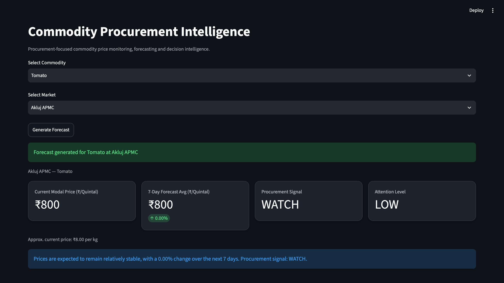
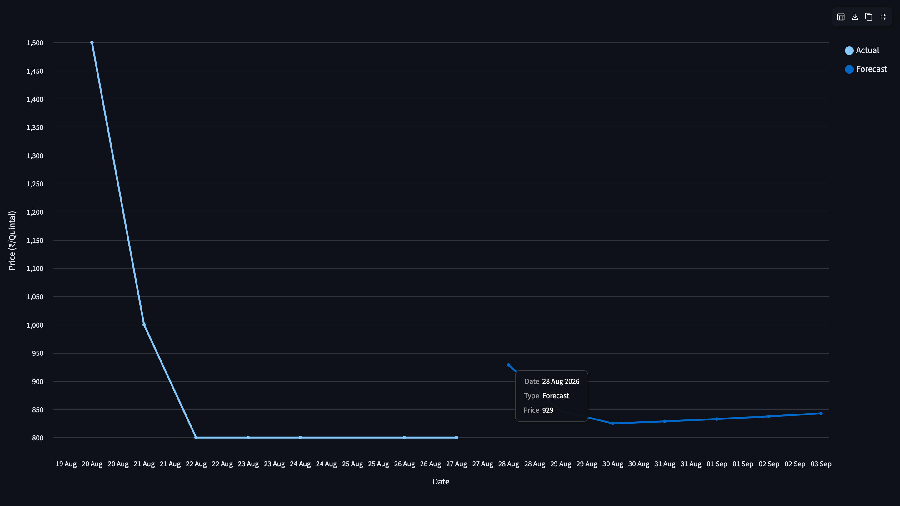
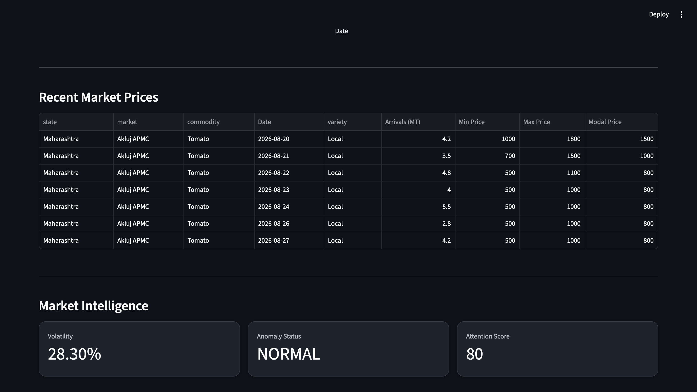

# Commodity Procurement Intelligence

A procurement-focused analytics platform that uses real agricultural market data to monitor commodity prices, compare forecasting methods, generate 7-day forecasts, and convert those forecasts into procurement signals.

Built with Python, Pandas, Scikit-learn, FastAPI, and Streamlit.

## What Problem Does It Solve?

Commodity buyers need more than historical prices.

They need to know:

* What is the current market price?
* What could prices look like over the next 7 days?
* Is the market volatile?
* Is the latest price unusual?
* Should procurement teams buy soon, wait, or continue watching?

This project turns raw mandi price data into decision-oriented procurement intelligence.

## Key Features

* Real agricultural market data from AGMARKNET
* Multiple commodities and Maharashtra APMC markets
* Historical data cleaning and anomaly handling
* Time-series feature engineering
* Chronological train/validation/test splitting
* Walk-forward validation
* Automatic forecast-method selection
* 7-day price forecasting
* Procurement signals
* Volatility analysis
* Price anomaly detection
* Procurement attention scoring
* FastAPI backend
* Interactive Streamlit dashboard

## Forecasting Methods

The project compares:

* Naive Baseline
* 7-Period Moving Average
* Trend Baseline
* Linear Regression

Forecast methods are compared using walk-forward validation.

The final test dataset is kept separate from model selection.

This allows the system to select the method that performs best instead of automatically choosing the most complex ML model.

## Example: Tomato — Akluj APMC

Walk-forward validation selected the **Naive Baseline** as the most reliable forecasting method.

| Method             | Validation MAE |  Test MAE |
| ------------------ | -------------: | --------: |
| **Naive Baseline** |     **327.45** | **65.22** |
| Moving Average     |         343.70 |    158.39 |
| Trend Baseline     |         377.78 |     89.13 |
| Linear Regression  |         423.49 |    327.11 |

### Final 7-Day Forecast

| Date | Predicted Modal Price |
|---|---:|
| 29 Aug 2026 | ₹800 |
| 30 Aug 2026 | ₹800 |
| 31 Aug 2026 | ₹800 |
| 01 Sep 2026 | ₹800 |
| 02 Sep 2026 | ₹800 |
| 03 Sep 2026 | ₹800 |
| 04 Sep 2026 | ₹800 |

The flat forecast is intentional. Walk-forward validation selected the Naive Baseline as the most reliable method for this market period.

## Procurement Intelligence Example

For Tomato — Akluj APMC:

| Metric | Result |
|---|---:|
| Current Modal Price | ₹800 / Quintal |
| Recent 7-Day Minimum | ₹800 |
| Recent 7-Day Maximum | ₹1,000 |
| Recent 7-Day Average | ₹828.57 |
| Forecast 7-Day Average | ₹800 |
| Expected Change | 0.00% |
| Procurement Signal | **WATCH** |
| Volatility | 9.12% |
| Anomaly Status | NORMAL |
| Attention Score | 20 |
| Attention Level | **LOW** |

## Dashboard



The Streamlit dashboard lets users select a commodity and market and view:

- Current modal price
- 7-day forecast
- Expected price movement
- Procurement signal
- Volatility
- Anomaly status
- Attention score
- Recent prices
- Actual vs forecast chart

### Forecast View



### Recent Market Prices




## Tech Stack

| Area             | Technology    |
| ---------------- | ------------- |
| Programming      | Python        |
| Data Analysis    | Pandas, NumPy |
| Machine Learning | Scikit-learn  |
| Backend          | FastAPI       |
| API Server       | Uvicorn       |
| Dashboard        | Streamlit     |
| Data Source      | AGMARKNET     |
| Version Control  | Git, GitHub   |

## Project Pipeline

```text
AGMARKNET Data
      ↓
Data Cleaning
      ↓
Feature Engineering
      ↓
Chronological Split
      ↓
Walk-Forward Validation
      ↓
Forecast Method Selection
      ↓
Final Test Evaluation
      ↓
7-Day Forecast
      ↓
Procurement Signal
      ↓
Volatility + Anomaly Detection
      ↓
Attention Score
      ↓
FastAPI + Streamlit
```

## API Endpoints

| Endpoint    | Purpose              |
| ----------- | -------------------- |
| `/`         | API status           |
| `/summary`  | Procurement summary  |
| `/forecast` | 7-day forecast       |
| `/recent`   | Recent market prices |

## Run Locally

```bash
git clone <repository-url>
cd commodity-procurement-intelligence

python3 -m venv .venv
source .venv/bin/activate

pip install -r requirements.txt
```

Run the pipeline:

```bash
PROCUREMENT_COMMODITY=Tomato \
PROCUREMENT_MARKET="Akluj APMC" \
python src/run_pipeline.py
```

Start FastAPI:

```bash
uvicorn api.main:app --reload
```

Start Streamlit in another terminal:

```bash
streamlit run app/streamlit_app.py
```

## Why This Project Is Strong

* Uses real-world agricultural market data
* Solves a business-oriented procurement problem
* Benchmarks ML against simpler baselines
* Uses walk-forward validation
* Avoids test-set leakage
* Includes forecasting, API, and dashboard layers
* Converts technical predictions into procurement decisions

## Future Improvements

* Weather integration
* More commodities and states
* Additional time-series models
* Cloud deployment
* Database storage
* Automated retraining
* Procurement alerts

## Disclaimer

This project is built for analytics, learning, and portfolio demonstration purposes. Forecasts should not be treated as guaranteed commercial or financial outcomes.

